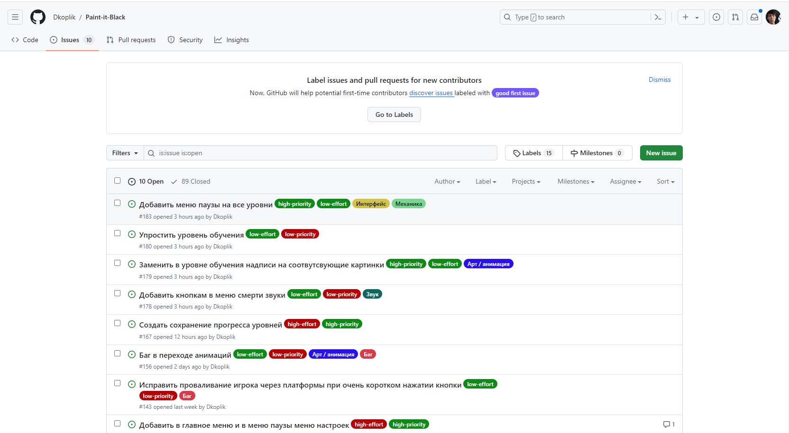
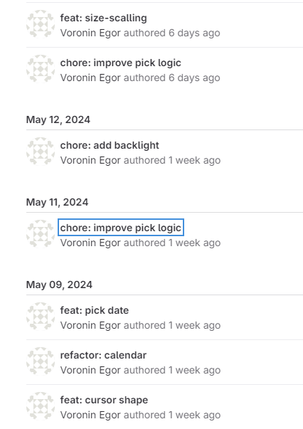
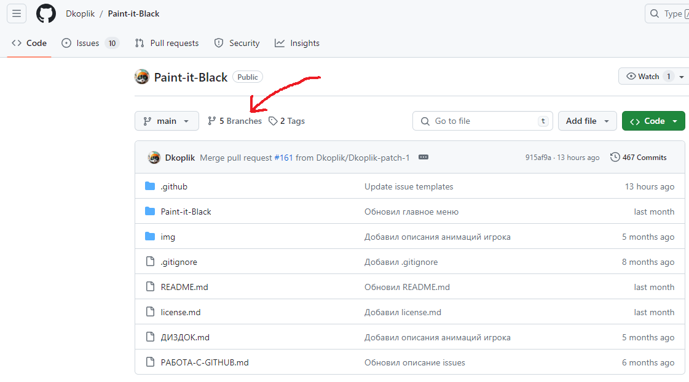
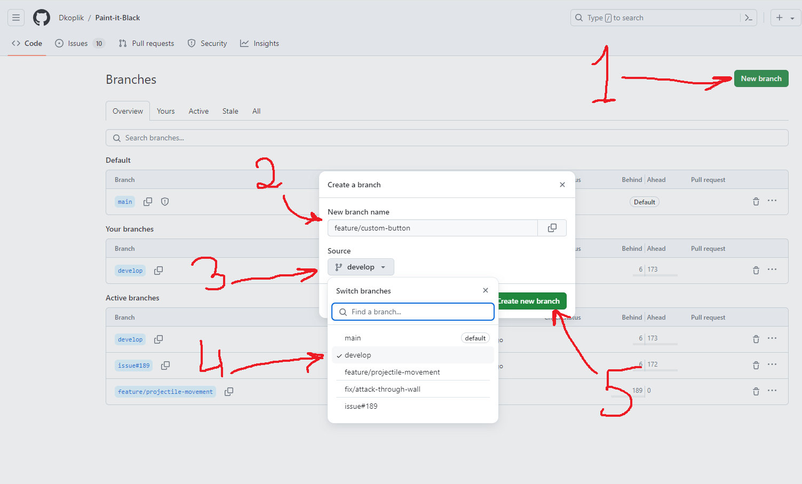
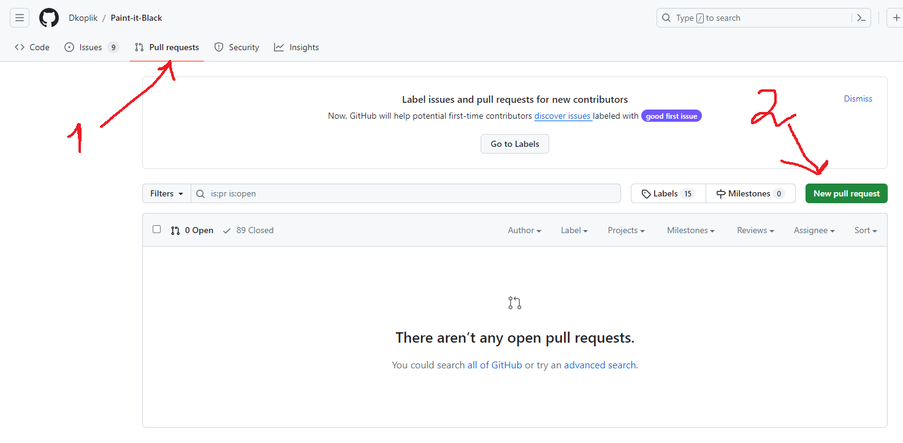
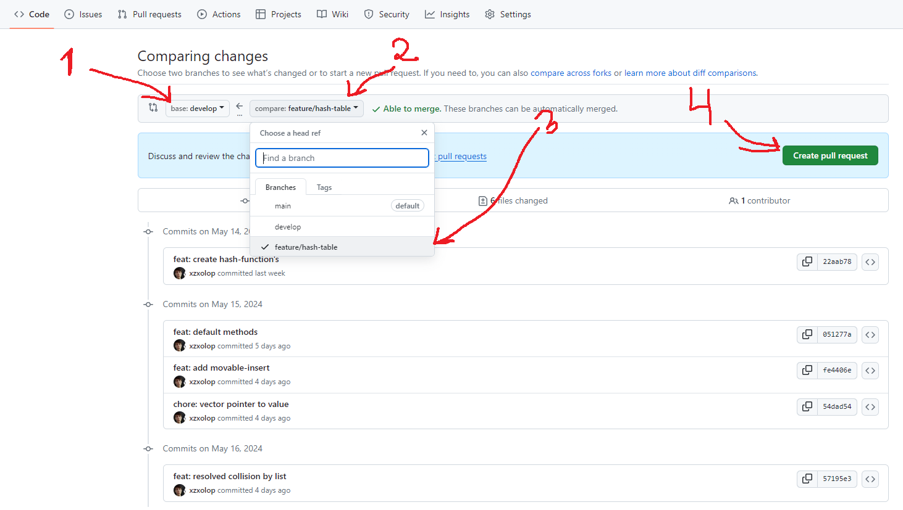
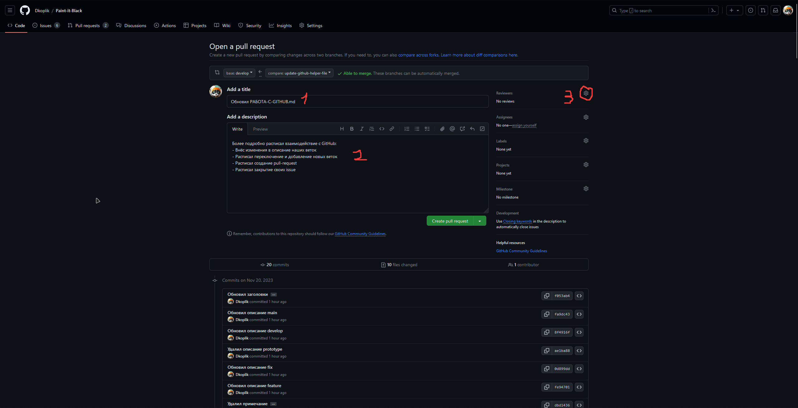

# Как работать c GITHUB?

## Цель руководства

Цель руководства в том, чтобы вести гит репозиторий, как прнято в серьезных командах и коммерческих компаниях.
При работе с гитом я прошу от вас трёх вещей:
1. Правильная работа с ветками 
2. Правильное именование веток
3. Правильное именование коммитов

Первые два пункта описанны в моделе Gitflow. 

## Модель разработки Gitflow.

### Gitflow - стиль ведения вашего git репозитория, который принят во всём мире, помогает вести репозиторий красиво и качесвтвенно (а не как в случае Ordis, Aloft).

## Ветки

### Основные (постоянные) ветки

#### main (иногда она называется master)

Главная ветка, в ней будет только стабильный код, то есть, готовый для билда. Более того, прямые коммиты в эту ветку запрещены. Остальным участникам про эту ветку, по сути, можно забыть, так как слияние других веток в main будет осуществлять тимлид. Код в main ветку обычно поподает из develop

#### develop

Наша основная ветка, тут будет самый свежий код, но он может работать немного нестабильно. Прямые коммиты в эту ветку нежелательны в 99% случаев. (исключением может быть точечное изменение файла, например этого, т.к. это на код никак не повлияет) 

Чтобы добавить новый код в develop нужно создавать отдельную ветку и потом делать pull-request в develop. При создании новой ветки, следует выбрать какой-то из предложенных типов:

- [fix/](#fix/)
- [feature/](#feature/)
- [Остальные ветки](#Остальные-ветки)

### Временные ветки (после пулл-реквестов их обычно удаляют)

#### feature/

Ветки, с названиями по формату `feature/название-ветки`. Их целью является добавление нового функционала: новое главное меню, новая механика, какой-нибудь визуальный эффект и тому подобное. Вместо `название-ветки` следует указать добавляемую механику (на английском, например, `feature/parriable-bullets`). После реализации поставленной задачи следует сделать pull-request в [develop](#develop).

#### fix/

Ветки, с названиями по формату `fix/название-ветки`. Их целью будет исправить какую-то ошибку, баг или несовместимость, иными словами, они не добавляют нового функционала, а исправляют старый. Соответственно, вместо `название-ветки` стоит указать исправляемую ошибку (на английском, например, `fix/stuck-in-wall`). Когда ошибка была исправлена, следует сделать pull-request в [develop](#develop).

#### Остальные ветки

Такие случаи будут крайне редкими, но, иногда надо будет внести какие-то изменения, которые не касаются ни исправления багов, ни добавления нового функционала. В таком случае название ветки стоит создавать в формате `название-ветки` (на английском, например, `update-design-document`). Соответственно, после осуществления поставленной задачи следует сделать pull-request в [develop](#develop).

## Issues 

Issue - это задача в GitHub. Её можно создать во вкладке Issues.
Вы присваеваете её имя, и вкратце расписываете, то что нужно сделать, чтобы решить эту задачу. 
Каждая ветка будет сопровоздаться своим issues.
Issue бывает разных типов: feature, fix, improvement и т.д. для каждой ветки он свой.
После слияния веток, issue закрывается.



## Коммиты (пишим на английском)

### Соглашение о коммитах

Спецификация «Соглашение о коммитах» — соглашение о том, как нужно писать сообщения коммитов.

Названия коммитов должны быть следующей структуры:

```
<тип>[необязательный контекст]: <описание> 
```
В конце названия коммита точка не ставиться.

Зачем использовать «Соглашение о коммитах»:

- Информирование товарищей по команде, общественности и других заинтересованных сторон о характере изменений.
- Упростите людям участие в ваших проектах, позволив им изучить более структурированную историю коммитов.

Типы возможных коммитов:

Основыне - ими вы будуте пользоваться чаще всего:
- feat: для новых фич (!фича это добовление чего-то нового и полноценного, например: механика стрельбы, новая функция с которой будет взаимодействовать пользователь, новая кнопка и т.д)
- fix: для баг-фиксов
- chore: для инных изменений которые не добавляют новую "фичу", и не фиксит баг это может быть изменение, улучшение, удаление и т.д.

Вспомогательные: 
- refractor: рефакториг кода
- style: changes that not affect the meaning of the code (white-space, formatting, missing semi-colons, etc)
- docs: documentation only changes
- perf: a code change that improves performance
- test: add missing test or correcting existing test
- build: changes that affect the build system or external dependencies
- ci: changes to our CI configuration files and scripts
- revert: reverts a previous commit

### Теперь названия коммитов будут такими:



Пример feat
```
Create math function - плохо
feat: math function - хорошо. 
```
В случае с feat писать create/add не обязательно, т.к. feat по умолчанию предусматривает добавление (т.е create/add) новой фичи.

Пример chore
```
Edit math function - плохо.
chore: edit math function - хорошо. 
```
В случае chore нужно указывать что именно вы сделали, т.к. это может быть изменение, улучшение, удаление и т.д.

Пример fix
```
fixed bug in myFunction - плохо
fix: myFunction - хорошо
```

Пример refacotor
```
refactored myCustomClass - плохо
refacotor: myCustomClass - хорошо
```

## Разработка

### И так, вот вы захотели создать библиотеку/добавить туда какую-то функцию. 

#### Создаём issue
Вы можете создать Issue сами, но если не получиться, то просите меня. Подробнее в пункте ISSUES

#### Создание ветки
Нажимаем на Branches, переходим во вкладку создания веток.


Далее создаём ветку в соответсвии с пунктом ВЕТКИ, например: feat/my-lib-function. Обычно все ветки создаются на основе develop ветки, в гите будет написанно based on develop. 


#### Пишим код
После этого вы переключаетесь на созданную ветку, и работаете в ней.
Коммиты именуем в соответствии с пунктом КОММИТЫ.

#### Pull-Request
Когда всё будет готово делайте Pull-Request (запрос на добавление вашего функционала в develop ветку).

Переходим во вкладку с пулл-реквестами. Жмем New Pull-Request.


Делаем Pull-Request (PR) из feat/hash-table в develop, в github будет написанно from feat/hash-table into develop.


 Название вашему PR будет дано гитом по умолчанию, но название такое себе, поэтому вы его переименуете так, как будто это просто коммит (например feat: hash-table). В качевстве ревьюера ставете меня.


 Когда PR будет открыт, его будет проверять ревьюер - я. **Сами вы кнопку merge не нажимаете, то есть мерджу только я**.

#### Code-Rewiew
Я буду проверять ваш код на корректность работы, и если всё норм, но одобряю и мерджу. Если не норм, то оставляю свои негативыне комментарии в github, и вы идёте их исправлять.

## Рекомендации
#### Github desctop 
Рекомендуется уствновить Github desctop, для более простой работы с git, чтобы не приходилось вписывать комманды в терминал, а работать с графическим интерфейсом.